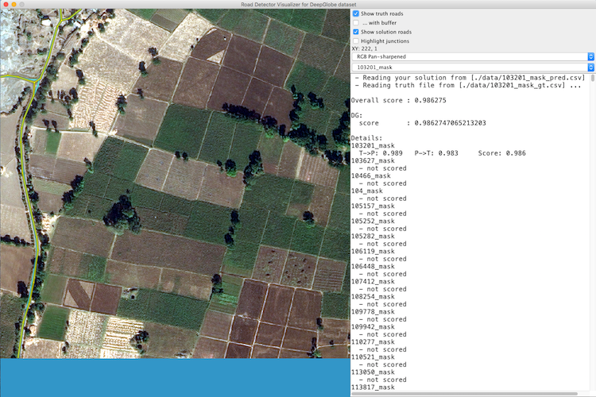

# Road visualizer for Spacenet and DeepGlobe dataset

The repository contains evaluation codes of [PP-LinkNet](https://arxiv.org/abs/2010.06932). If you feel this repository useful, please cite our paper:

```
@inproceedings{AnTran_ACMMM_2020,
author = {Tran, An and Zonoozi, Ali and Varadarajan, Jagannadan and Kruppa, Hannes},
title = {PP-LinkNet: Improving Semantic Segmentation of High Resolution Satellite Imagery with Multi-Stage Training},
year = {2020},
isbn = {9781450381550},
publisher = {Association for Computing Machinery},
address = {New York, NY, USA},
url = {https://doi.org/10.1145/3423323.3423407},
doi = {10.1145/3423323.3423407},
abstract = {Road network and building footprint extraction is essential for many applications such as updating maps, traffic regulations, city planning, ride-hailing, disaster response etc. Mapping road networks is currently both expensive and labor-intensive. Recently, improvements in image segmentation through the application of deep neural networks has shown promising results in extracting road segments from large scale, high resolution satellite imagery. However, significant challenges remain due to lack of enough labeled training data needed to build models for industry grade applications. In this paper, we propose a two-stage transfer learning technique to improve robustness of semantic segmentation for satellite images that leverages noisy pseudo ground truth masks obtained automatically (without human labor) from crowd-sourced OpenStreetMap (OSM) data. We further propose Pyramid Pooling-LinkNet (PP-LinkNet), an improved deep neural network for segmentation that uses focal loss, poly learning rate, and context module. We demonstrate the strengths of our approach through evaluations done on three popular datasets over two tasks, namely, road extraction and building foot-print detection. Specifically, we obtain 78.19% meanIoU on SpaceNet building footprint dataset, 67.03% and 77.11% on the road topology metric on SpaceNet and DeepGlobe road extraction dataset, respectively.},
booktitle = {Proceedings of the 2nd Workshop on Structuring and Understanding of Multimedia HeritAge Contents},
pages = {57–64},
numpages = {8},
keywords = {pp-linknet, remote sensing, building footprint, mapping application, multi-stage training, road network, hyperspectral imaging, transfer learning},
location = {Seattle, WA, USA},
series = {SUMAC'20}
}
```

This software is a modification of Visualizer from Spacenet competition for road extraction. I made it work for DeepGlobe dataset also. The original competition and code are at https://community.topcoder.com/longcontest/?module=ViewProblemStatement&rd=17036&pm=14735.

## Usage
For Spacenet dataset:
```
java -jar visualizer.jar -params ./data/params.txt
```

For DeepGlobe dataset:
```
java -jar visualizerDG.jar -params ./data/paramsDG.txt
```
Please change the corresponding parameters in `paramsDG.txt` to the image folder, ground truth, and mask prediction.
The following image shows a screenshot of a APLS visualization:


